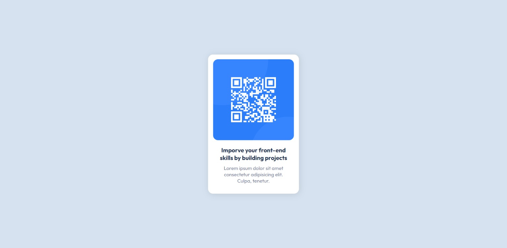

<h1>QR code component by FrontEnd Mentor</h1>

<h2>
  <a href="https://www.frontendmentor.io/challenges/qr-code-component-iux_sIO_H"
    >=> Challenge Link</a
  >
</h2>

<h2>
  <a href="https://dinethlive.github.io/QR-code-component-by-frontend-mentor/">
    => My Solution ( DEMO )
  </a>
</h2>

<h2>=> FrontEnd Mentor Solution</h2>

<h2>=> My Solution ScreenShot</h2>

<h3>What I learned ?</h3>
<ul>
  <li>CSS FlexBox</li>
  <li>calc() usage</li>
</ul>

<h4>Thank you FrontEnd Mentor</h4>
